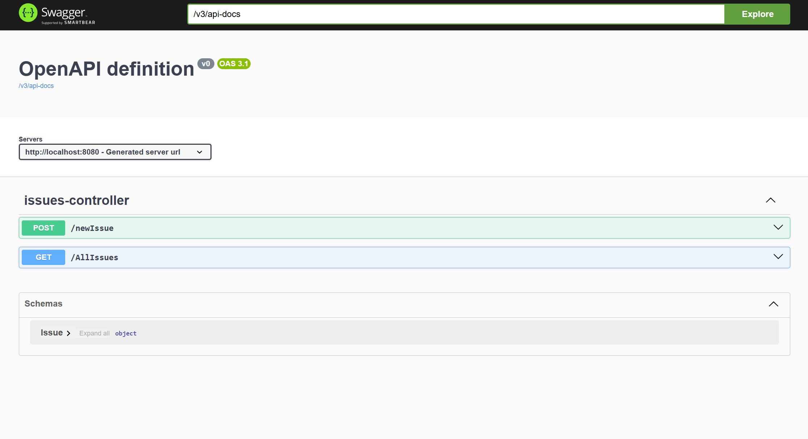

# CaseAssist 🧑‍⚖️💬

**CaseAssist** is a simple lawyer consultancy website. People who have legal problems can submit their complaints on the website. A lawyer can view the complaint, accept it, and solve the issue. The user and the lawyer can talk to each other using a chat feature. 

Both user and lawyer have their own login and dashboard. The only shared feature between them is the chat interface.

---

## 🌟 Features

### For Users:
- Sign up and log in securely
- Submit legal complaints
- View complaint status on the dashboard
- Chat with the lawyer
- 📊 See a chart of:
  - Total complaints
  - Complaints in progress
  - Complaints resolved (closed)
  - Pending complaints

### For Lawyers:
- Sign up and log in securely
- See and accept complaints
- Update the case status
- Chat with the user
- 📊 See a chart of:
  - All assigned cases
  - Closed cases
  - In-progress cases
  - Pending responses

---

## 🛠️ Tech Stacks
### 🖥️ Frontend:
HTML
CSS
JavaScript
Bootstrap (for design)
Chart.js (or other chart library) for displaying charts

### 🔙 Backend - Java Spring Boot
#### 🔐 Authentication:
Secure user and lawyer login/signup system implemented using Spring Security and JWT (JSON Web Tokens).

#### 🗄️ Database:
User and case data stored in MySQL using Spring Data JPA.
Real-time chat functionality implemented using WebSocket and persisted in MySQL.

#### 🔒 Security:
Role-based access control ensures separate access for users and lawyers.
All endpoints are protected using Spring Security configuration.
Data validation, authorization, and secure communication enforced throughout the backend.

---
## 📄 CaseAssist Documentation & Diagrams

### 📘 CaseAssist API Documentation  
[📄 View Document](https://docs.google.com/document/d/1m2o72Sg9VfBXFqvkt82JTSfqPwyewefS/edit?usp=sharing&ouid=100119364837244355757&rtpof=true&sd=true)

### 🏛️ Architecture Diagram  
[🏛️ View Document](https://docs.google.com/document/d/1z5ldvRBcj6RcUEodqENw3_I8Ly7HDUqR/edit?usp=sharing&ouid=100119364837244355757&rtpof=true&sd=true)

### 🗂️ ER Diagram  
[🗂️ View Document](https://docs.google.com/document/d/1jtRY72AQkCma2Gtz29RGYIaUHd1mDdWi/edit?usp=sharing&ouid=100119364837244355757&rtpof=true&sd=true)

### 🖼️ Swagger API Screenshot  

